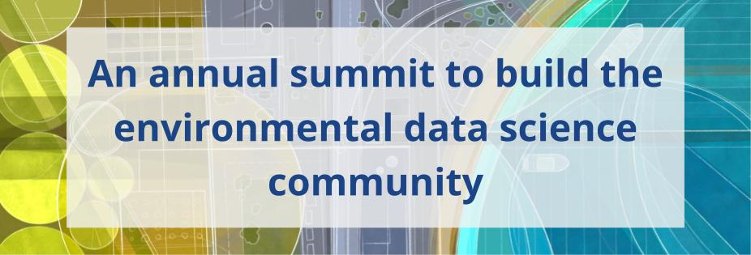
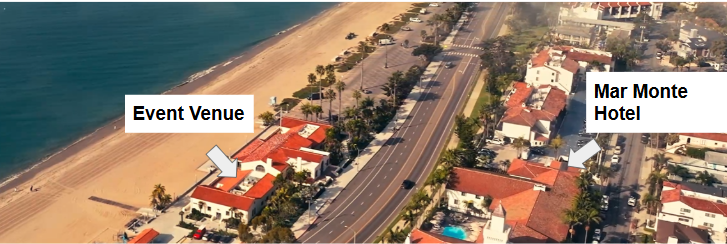

{fig-align="center"}

# **January 27-29, 2026 \| Santa Barbara, CA**

Hosted by the [**National Center for Ecological Analysis and Synthesis**](https://www.nceas.ucsb.edu/)

------------------------------------------------------------------------

Environmental Data Science (EDS) is a growing field of interdisciplinary approaches to investigating and answering environmental questions with modern data science tools. The field is broad, diverse, and expanding. This Summit aims to bring together all types of environmental data scientists to lay the foundation for a more cohesive and collaborative transdisciplinary community.

The goals of the Summit are to **build community** and **foster collaboration** within the Environmental Data Science community. This year's theme is **Turning Data into Action:** How can we bridge the gap between environmental data science and real-world applications, especially in support of policy, management, and community engagement?

```{=html}
<!-- ------------------------------------------------------------------------

# Participation

Applications are now open. **Please fill out the [application materials](https://docs.google.com/forms/d/e/1FAIpQLSeqCIwHpKXzBhhhy7X0spjNHEHM9_nyXNJz-F_JW1pwC2u3SQ/viewform) by October 8, 2025**

Participation is limited to 100 attendees, with an application required. We are able to provide funding for up to 60 participants. Funding will cover travel to Santa Barbara, lodging, and the Summit registration fee. In order to attend you must first apply. Applications will be used both to select participation and award funding.

Participant attendance is not limited by sector, discipline, background, or career stage. If you use data to ask questions about our environment and how we interact with it, this Summit is for you! -->
```

# Workshop Details

------------------------------------------------------------------------

{fig-align="center"}

* **Workshop Hotel** - The [Mar Monte Hotel](https://marmontehotel.com/){target="_blank}

* **Workshop Venue** - The [Cabrillo Pavilion](https://sbparksandrec.santabarbaraca.gov/venues/cabrillo-pavilion-event-center){target="_blank}, 1118 East Cabrillo Blvd, located across the street from the Hotel


# Agenda

------------------------------------------------------------------------

### Day 1 - January 27, 2026

+-----------+------------------------------------------------------------------------------------------------------------------------------------------------------------------------------------------------------------------------------------------------------------------------------------------+
| Time      | Activity                                                                                                                                                                                                                                                                                 |
+===========+==========================================================================================================================================================================================================================================================================================+
| 8:15      | **Registration** - Check in at the lobby of the Cabrillo Pavilion                                                                                                                                                                                                                        |
+-----------+------------------------------------------------------------------------------------------------------------------------------------------------------------------------------------------------------------------------------------------------------------------------------------------+
| 8:30      | Breakfast, Get to Know & Welcome                                                                                                                                                                                                                                                         |
+-----------+------------------------------------------------------------------------------------------------------------------------------------------------------------------------------------------------------------------------------------------------------------------------------------------+
| 9:15      | **Keynote Speaker** - Alex Reed, Project Manager, Mapping Black California                                                                                                                                                                                                               |
|           |                                                                                                                                                                                                                                                                                          |
|           | **Combating Racism as a Public Health Crisis** - From Declarations to Action: How Data Preservation and Local News Engagement Can Drive Accountability                                                                                                                                   |
+-----------+------------------------------------------------------------------------------------------------------------------------------------------------------------------------------------------------------------------------------------------------------------------------------------------+
| 10:00     | **Coffee Break**                                                                                                                                                                                                                                                                         |
+-----------+------------------------------------------------------------------------------------------------------------------------------------------------------------------------------------------------------------------------------------------------------------------------------------------+
| 10:30     | **Instructions for the day**                                                                                                                                                                                                                                                             |
+-----------+------------------------------------------------------------------------------------------------------------------------------------------------------------------------------------------------------------------------------------------------------------------------------------------+
| 10:45     | **Ideation Session** - Facilitated brainstorming to lay the groundwork for small group working sessions                                                                                                                                                                                  |
+-----------+------------------------------------------------------------------------------------------------------------------------------------------------------------------------------------------------------------------------------------------------------------------------------------------+
| 11:30     | **Poster & Flash Talk Prep** - In your group, create a minimalist poster that communicates your idea and prep a 1 minute flash talk. Each group has 1 minute to present their idea to the group. During lunch, everyone explores the posters and thinks about what they want to work on. |
+-----------+------------------------------------------------------------------------------------------------------------------------------------------------------------------------------------------------------------------------------------------------------------------------------------------+
| 12:30     | **Lunch**                                                                                                                                                                                                                                                                                |
+-----------+------------------------------------------------------------------------------------------------------------------------------------------------------------------------------------------------------------------------------------------------------------------------------------------+
| 1:30      | **Instructions and Next Steps**                                                                                                                                                                                                                                                          |
+-----------+------------------------------------------------------------------------------------------------------------------------------------------------------------------------------------------------------------------------------------------------------------------------------------------+
| 1:35      | **Flash Talks**                                                                                                                                                                                                                                                                          |
+-----------+------------------------------------------------------------------------------------------------------------------------------------------------------------------------------------------------------------------------------------------------------------------------------------------+
| 2:45      | **Coffee Break**                                                                                                                                                                                                                                                                         |
+-----------+------------------------------------------------------------------------------------------------------------------------------------------------------------------------------------------------------------------------------------------------------------------------------------------+
| 3:00      | **Breakout group work**                                                                                                                                                                                                                                                                  |
+-----------+------------------------------------------------------------------------------------------------------------------------------------------------------------------------------------------------------------------------------------------------------------------------------------------+
| 4:50      | **Day 1 Wrap Up**                                                                                                                                                                                                                                                                        |
+-----------+------------------------------------------------------------------------------------------------------------------------------------------------------------------------------------------------------------------------------------------------------------------------------------------+
| 5:00      | **Sunset cocktail hour**                                                                                                                                                                                                                                                                 |
+-----------+------------------------------------------------------------------------------------------------------------------------------------------------------------------------------------------------------------------------------------------------------------------------------------------+
| 6:00      | **Dinner**                                                                                                                                                                                                                                                                               |
+-----------+------------------------------------------------------------------------------------------------------------------------------------------------------------------------------------------------------------------------------------------------------------------------------------------+
| 7:00      | **Get Funky with the Steering Committee** - Join steering committee members in the Santa Barbara “Funk Zone” to continue conversations, network and have a little fun.                                                                                                                   |
+-----------+------------------------------------------------------------------------------------------------------------------------------------------------------------------------------------------------------------------------------------------------------------------------------------------+

### Day 2 - January 28, 2026

+-----------+--------------------------------------------------------------------------------------------+
| Time      | Activity                                                                                   |
+===========+============================================================================================+
| 8:30      | **Breakfast**                                                                              |
+-----------+--------------------------------------------------------------------------------------------+
| 9:00      | **Welcome to Day 2**                                                                       |
+-----------+--------------------------------------------------------------------------------------------+
| 9:05      | **Keynote Speaker** - Scott Reinhard, Cartographer & former graphics editor New York Times |
|           |                                                                                            |
|           | **Visceral Data Graphics**                                                                 |
+-----------+--------------------------------------------------------------------------------------------+
| 9:50      | **Day 2 Instructions**                                                                     |
+-----------+--------------------------------------------------------------------------------------------+
| 10:00     | **Coffee break**                                                                           |
+-----------+--------------------------------------------------------------------------------------------+
| 10:15     | **Midway Group Presentations** - Present initial ideas,re-evaluate, consider adding ideas  |
+-----------+--------------------------------------------------------------------------------------------+
| 12:15     | **Lunch**                                                                                  |
+-----------+--------------------------------------------------------------------------------------------+
| 1:15      | **Breakout Group Work**                                                                    |
+-----------+--------------------------------------------------------------------------------------------+
| 3:15      | **Coffee break**                                                                           |
+-----------+--------------------------------------------------------------------------------------------+
| 3:45      | **Breakout Group Work**                                                                    |
+-----------+--------------------------------------------------------------------------------------------+
| 4:30      | **Day 2 Wrap up**                                                                          |
+-----------+--------------------------------------------------------------------------------------------+
| 4:45      | **Free Time (explore the area)** - Bar opens at 5:00pm                                     |
+-----------+--------------------------------------------------------------------------------------------+
| 6:00      | **Dinner**                                                                                 |
+-----------+--------------------------------------------------------------------------------------------+

### Day 3 - January 29, 2026

+-----------+--------------------------------------------------------------------------------------------------------------------------------------+
| Time      | Activity                                                                                                                             |
+===========+======================================================================================================================================+
| 8:30      | **Breakfast**                                                                                                                        |
+-----------+--------------------------------------------------------------------------------------------------------------------------------------+
| 9:00      | **Welcome to Day 3**                                                                                                                 |
+-----------+--------------------------------------------------------------------------------------------------------------------------------------+
| 9:05      | **Final Group Presentations** - Groups present the work they have done and share plans if they wish to continue their project/idea.  |
+-----------+--------------------------------------------------------------------------------------------------------------------------------------+
| 10:15     | **Coffee break**                                                                                                                     |
+-----------+--------------------------------------------------------------------------------------------------------------------------------------+
| 10:30     | **Final Group Presentations**                                                                                                        |
+-----------+--------------------------------------------------------------------------------------------------------------------------------------+
| 11:30     | **Next Steps Discussion**                                                                                                            |
+-----------+--------------------------------------------------------------------------------------------------------------------------------------+
| 12:00     | **Closing**                                                                                                                          |
+-----------+--------------------------------------------------------------------------------------------------------------------------------------+
| 12:15     | **Depart**                                                                                                                           |
+-----------+--------------------------------------------------------------------------------------------------------------------------------------+

```{=html}
<!-- # Location & Lodging

{fig-align="center"}

The Summit will take place at the [Cabrillo Arts Pavilion](https://cabrillopavilion.santabarbaraca.gov/), situated adjacent to the beach.

The [Mar Monte Hyatt Hotel](https://www.hyatt.com/en-US/hotel/california/mar-monte-hotel/sbars) is directly across the street from the Pavilion and will be the most convenient hotel for attendees. There are additional hotels within walking distance from the Pavilion.

### Event Parking

If you are not staying at the Mar Monte Hotel, there is ample parking in [city parking lots](https://goo.gl/maps/6iihTuXCtmYxbrEz9) next to the Cabrillo Pavilion. **Parking at these waterfront lots costs \$3.00/hour or \$18 for the day**. There is free parking within a short walking distance along Cabrillo boulevard, near the [East Beach volleyball courts](https://goo.gl/maps/YoLd2nJwcmH4cqhy7) and near [Dwight Murphy Field](https://goo.gl/maps/y82sUHe4TAHgDcLp9).  -->
```

<!-- ------------------------------------------------------------------------ -->

<br>

**Steering Committee**

[Ben Halpern](https://www.nceas.ucsb.edu/about-us/our-people) \| [Elizabeth Wolkovich](https://biodiversity.ubc.ca/people/faculty/elizabeth-m-wolkovich) \| [Noam Ross](https://www.noamross.net/) \| [Amanda Whitmire](https://library.stanford.edu/people/amanda-whitmire) \| [Susan Shingledecker](https://www.esipfed.org/about/staff/susan-shingledecker) \| [Dawn Wright](https://dusk.geo.orst.edu/index.html) \| [Dorris Scott](https://dscott.netlify.app/) \| [Leah Wasser](https://www.leahwasser.com/)

------------------------------------------------------------------------

A Research Coordination Network, hosted by the [National Center for Ecological Analysis and Synthesis](https://www.nceas.ucsb.edu/) and funded by the National Science Foundation.

[**Sign up to receive information about the Summit**](https://landing.mailerlite.com/webforms/landing/a5o1r3)

{fig-align="center" width="314"}
